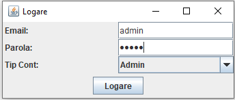
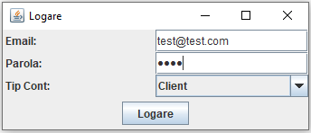
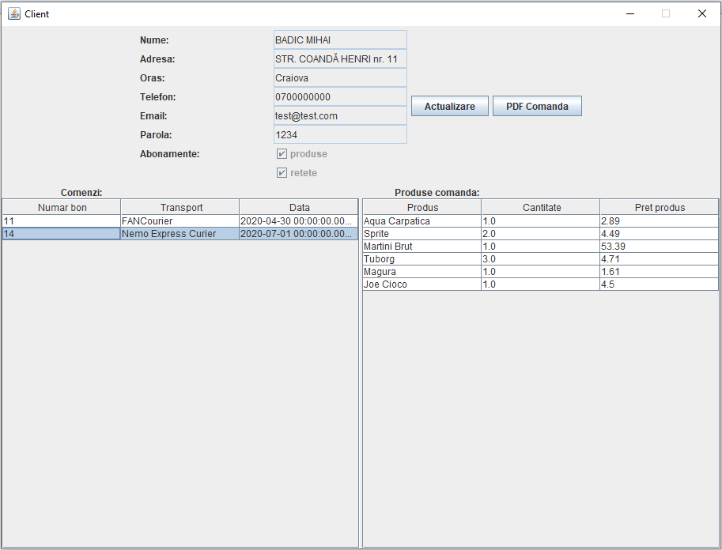
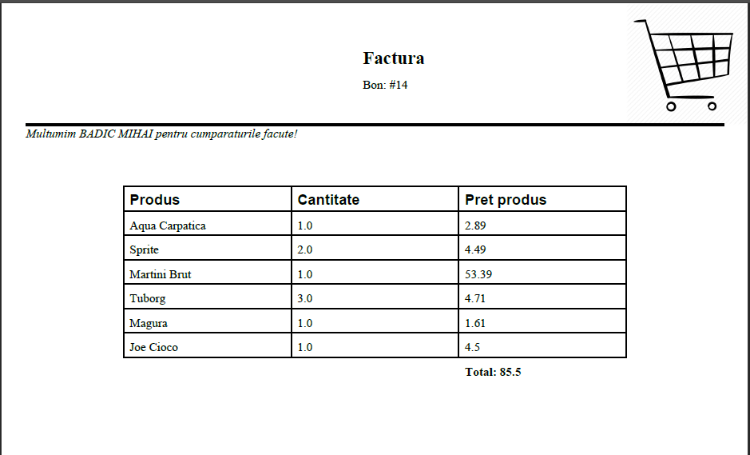
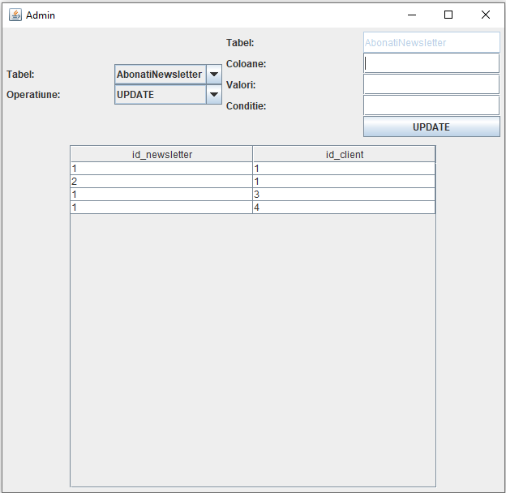

# Proiect practica an 2
### Cuprins

- Descriere
- Tehnologii
- Librarii
- Cum functioneaza

## Descriere
Aceasta aplicatie este menita pentru 2 actori, anume administratorul si clientii unui supermarket.
Pentru a putea avea acces, utilizatorii vor trebuii sa se logheze in aplicatie, in functie de rolul acestora.

Administratorul va avea acces la vizualizarea dateleor, modificarea dateleor si stergerea dateleor din baza de date.

Clientul va avea acces la comenzile sale, continutul acestora, posibilitatea de a-si modifica datele personale si abonarea/dezabonarea de la newsletter-uri.
## Tehnologii
- Limbajul Java
- Baza de date Access

## Librarii
- PDFBox
- UCanAccess

## Cum functioneaza

### Imagini in timpul rularii

#### Vizualizare form logare

#### Vizualizare form clienti

#### Vizualizare form pdf generat

#### Vizualizare form admin

